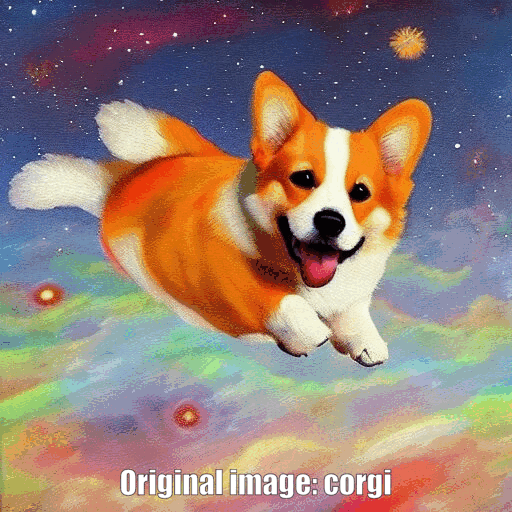

# StableDiffusion MagicMix

Since the ByteDance paper titled "MagicMix: Semantic Mixing with Diffusion Models" (https://arxiv.org/abs/2210.16056) didn't publish their code, I've implemented a Jupyter notebook here, so you can try it out.

The notebook implements a function called `magic_mix` which takes the path to an image and the prompt towards which it should adapt the image.

Additional optional parameters:

nu: controls how much the prompt should overwrite the original image in the initial layout phase. If your result is too close to the original image, try increasing this parameter.

total_steps: number of inference steps for stable diffusion

guidance_scale: this is the classifier free guidance. The higher this is set, the more it will drive your result towards your prompt.

Examples:

